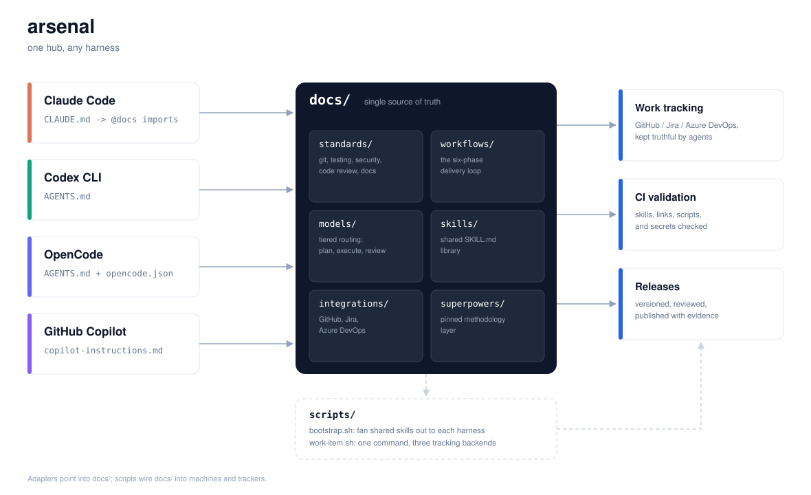

# arsenal

**One shared hub for every AI coding agent on your team.**

Arsenal is a template repository that centralizes agent skills, engineering
standards, model routing, and work tracking in a single `docs/` folder that
Claude Code, Codex CLI, OpenCode, and GitHub Copilot all read. Clone it once,
point every harness at it, and stop re-teaching each tool how your team works.



## The problem it solves

Teams adopt AI coding agents piecemeal. Each harness brings its own config
file, its own skill format, and its own habits. Within a quarter you have
four half-overlapping rulebooks, model spend nobody planned, tests the agents
quietly stopped running, and work tracked in whatever tool the loudest
engineer prefers. The agents are not the problem. The missing shared
infrastructure is.

Arsenal is that infrastructure:

- **One source of truth.** Standards, workflows, model policy, and skills live in
  `docs/`. Root-level adapter files (`AGENTS.md`, `CLAUDE.md`,
  `.github/copilot-instructions.md`, `opencode.json`) point every harness at it.
  Guidance is written once and read everywhere.
- **A delivery loop with gates.** Research, plan, execute, verify, track,
  publish. Each phase has entry criteria, a defined owner (human or agent
  tier), and a gate. Code does not move forward through a red test suite.
- **Model routing by tier.** Strategist models plan and review. Executor models
  write code. The policy and the per-harness wiring live in
  [`docs/models/routing.md`](docs/models/routing.md), so the expensive models
  spend their tokens where they change outcomes.
- **Work tracking that follows the work.** One command,
  `scripts/work-item.sh`, creates and updates work items in GitHub Issues,
  Jira, or Azure DevOps. Agents stamp the IDs; the tracker stays truthful.
- **The Superpowers methodology, pinned.** The open-source Superpowers skill
  library (brainstorm, plan, TDD, subagent development) is installed per
  harness from a pinned version recorded in [`docs/superpowers/`](docs/superpowers/README.md).
- **Validated by CI.** Skill frontmatter, internal links, and shell scripts are
  checked on every push, so the hub cannot rot quietly.

## Harness support

| Harness | Entry file | Skills wiring | Guide |
| --- | --- | --- | --- |
| Claude Code | `CLAUDE.md` (imports `docs/`) | `.claude/skills/` via bootstrap | [`docs/harness/claude-code.md`](docs/harness/claude-code.md) |
| Codex CLI | `AGENTS.md` | skills dir via bootstrap | [`docs/harness/codex.md`](docs/harness/codex.md) |
| OpenCode | `AGENTS.md` + `opencode.json` | `.opencode/skills/` via bootstrap | [`docs/harness/opencode.md`](docs/harness/opencode.md) |
| GitHub Copilot | `.github/copilot-instructions.md` (+ `AGENTS.md` for the coding agent) | workspace skills | [`docs/harness/copilot.md`](docs/harness/copilot.md) |

Any harness that reads `AGENTS.md` or the Agent Skills standard works with the
same pattern. `docs/harness/README.md` shows how to add the next one.

## Quick start

```bash
# 1. Create your repo from this template (green "Use this template" button) or:
git clone https://github.com/Alex5350/arsenal.git your-repo && cd your-repo

# 2. Wire the shared skills into every harness on your machine:
scripts/bootstrap.sh          # add --dry-run to preview

# 3. Open the repo in any harness and start with:
#    "Read AGENTS.md and begin."
```

Humans should start at [`docs/README.md`](docs/README.md). Deep design notes
live in [`TECHNICAL.md`](TECHNICAL.md), and terminology in
[`GLOSSARY.md`](GLOSSARY.md).

## The delivery loop


Six phases, each with a gate. Strategist models own research and planning,
executor models own implementation, and the reviewer tier owns verification
evidence. Full definitions in [`docs/workflows/`](docs/workflows/README.md).

## What is inside

```
docs/
  README.md          hub map and reading order
  ARCHITECTURE.md    how the hub is wired, and why
  harness/           per-harness adapter guides (4 + how to add more)
  standards/         git, testing, security, code review, documentation
  workflows/         the six-phase delivery loop, phase by phase
  models/            tiered model routing policy and per-harness wiring
  skills/            shared Agent Skills (SKILL.md, open standard)
  integrations/      GitHub Issues, Jira, Azure DevOps
  superpowers/       pinned Superpowers methodology layer
  templates/         starter CI workflow and tracking config
scripts/
  bootstrap.sh       fan shared skills out to each harness
  work-item.sh       one command, three tracking backends
  validate-skills.sh SKILL.md frontmatter linter (CI)
  check-links.sh     internal markdown link checker (CI)
```

## Built on open standards

Arsenal commits to the three standards the industry converged on rather than
to any vendor:

- [AGENTS.md](https://agents.md) for tool-agnostic instructions
- [Agent Skills](https://agentskills.io) (`SKILL.md`) for portable procedural knowledge
- [MCP](https://modelcontextprotocol.io) for tool and data connections

When a harness changes, the adapter changes. The hub does not.

## License and attribution

MIT. See [LICENSE](LICENSE). The [Superpowers](https://github.com/obra/superpowers)
skill library it installs is MIT work by Jesse Vincent and contributors;
arsenal references and pins it but does not redistribute it.
