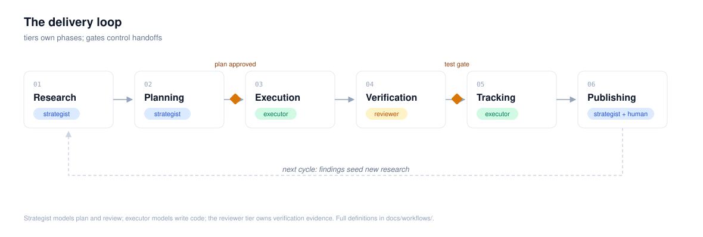

# The delivery loop

Six phases, two gates, three model tiers. The loop is the same whether the
work is a bug fix or a quarter-long effort; only the size of each artifact
changes.

| Phase | Owner | Entry criteria | Exit artifact | Gate to next |
| --- | --- | --- | --- | --- |
| [01 Research](01-research.md) | strategist | a question worth answering | findings doc with citations | open questions resolved or converted to tasks |
| [02 Planning](02-planning.md) | strategist | findings or an approved request | written plan | **plan approved** |
| [03 Execution](03-execution.md) | executor | approved plan, work item created | implementation in a worktree | reviewer request opened |
| [04 Verification](04-verification.md) | reviewer | diff + plan + test evidence | verified diff with evidence | **test gate green** |
| [05 Tracking](05-tracking.md) | executor | every phase transition | tracker state matches reality | tracker current |
| [06 Publishing](06-publishing.md) | strategist + human | verified, tracked work | tagged release + notes | post-release check passes |

## Rules of the loop

1. Phases happen in order. Skipping research to "save time" is how a plan
   solves the wrong problem.
2. The gates are hard. Work does not pass a red gate; see
   [the testing standard](../standards/testing.md).
3. Tracking runs continuously, not at the end: every transition in any phase
   is mirrored to the tracker within the same session that caused it.
4. The loop ends by starting again: publishing a cycle seeds the research
   backlog for the next one.

## How phases map to the hub

- Tiers and model assignments: [models/routing.md](../models/routing.md)
- Methodology skills for planning and execution (Superpowers):
  [superpowers/](../superpowers/README.md)
- Arsenal skills that carry each phase: [skills/](../skills/README.md)
- Tracker commands: [integrations/](../integrations/README.md) and
  `scripts/work-item.sh`
